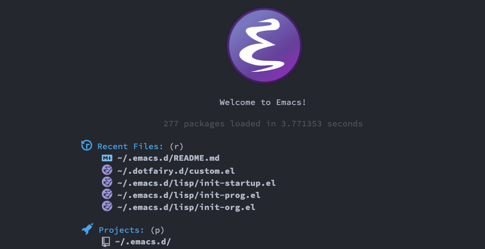
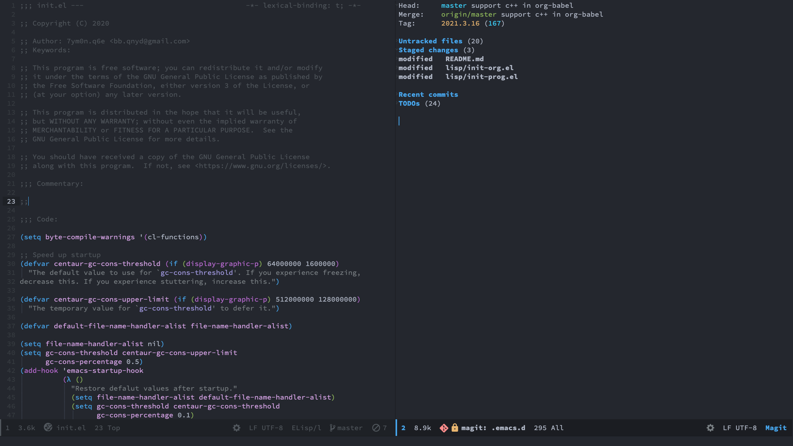
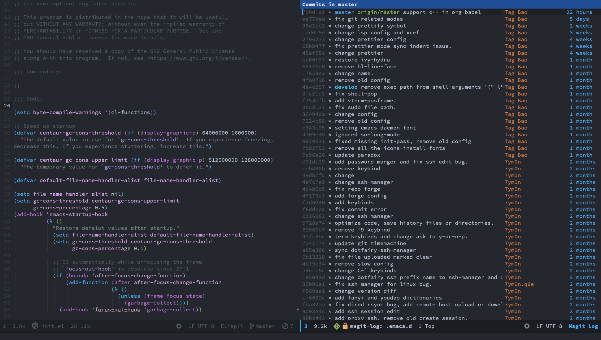
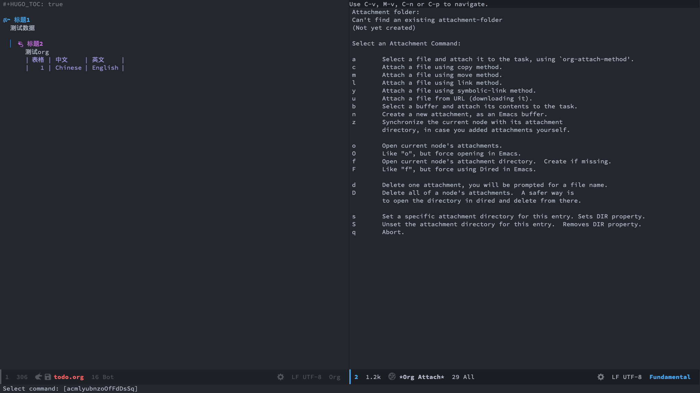
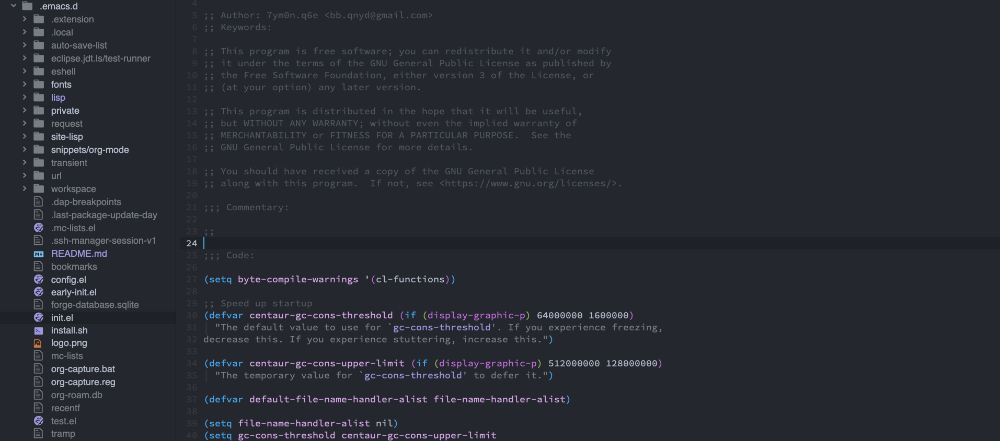
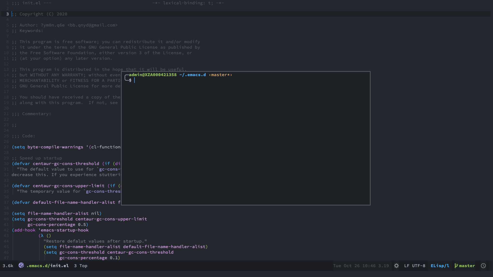

# Dotfairy


`Dotfairy` is a configuration modified based on [`Doom`](https://github.com/doomemacs/doomemacs) and [`Centaur`](https://github.com/seagle0128/.emacs.d), It's work on GNU/Linux, MacOS and Windows 7 later(Some component functions may not work properly).

## Feature

- Clean and Fast.
- Quick fuzzy search.
- Better Org/Markdown/Hugo support.
- Support multiple programming languages

  - C/C++/Java/Python/Shell/Golang/Rust
  - JavaScript/Typescript/JSON/YAML
  - HTML/CSS/XML/React

- Auto completion.
- Fly syntax check.
- Fly spell check.
- Git integration.
- Project/Workspace integration.
- Pomodor integration.
- Support Docker/K8s.
- Support SSH manager.
- Support Pass manager password.
- Better Chinese support:
  - Chinese calendar
  - Youdao/Fanyi

## Usage

## Introduction

Please read [blog](https://yourrepository.com/post/manual/how-do-myself-custom-editor/).

## Install

Now, You can download [denv](https://github.com/7ym0n/denv) scripts. use it install environment.

```shell
mv ~/.emacs.d{,.backup} && git clone https://github.com/7ym0n/dotfairy.git ~/.emacs.d

# install base tools and program develop environment.
git clone https://github.com/7ym0n/denv
cd denv && bash denv --install --sudo
```

## Manual

Add or change the configurations in `~/dotfairy.d/custom.el`, then restart Emacs.

```elisp
(require 'init-const)
(require 'init-custom)

(setq dotfairy-full-name "user name")           ; User full name
(setq dotfairy-mail-address "user@email.com")   ; Email address
;; (setq dotfairy-proxy "127.0.0.1:1080")          ; Network proxy
(setq dotfairy-quelpa-upgrade nil) ; Enable `quelpa-upgrade-p' t or nil
;; (setq dotfairy-completion-style 'childframe) ; Completion display style default `childframe', or set `minibuffer'.
;; (setq dotfairy-server nil)                      ; Enable `server-mode' or not: t or nil
(setq dotfairy-keybind-mode 'emacs) ; Enable `vim-like' or `emacs'.
(setq dotfairy-package-archives 'netease)   ; Package repo: melpa, emacs-china, netease, bfsu, ustc or tuna
;; Color theme:
;; dotfairy-theme-list
;; '((default . doom-one)
;;   (doom-one . doom-one)
;;   (doom-monokai-pro     . doom-monokai-pro)
;;   (doom-dark+    . doom-dark+)
;;   (doom-one-light   . doom-one-light)
;;   (doom-solarized-light    . doom-solarized-light)
;;   (doom-city-lights    . doom-city-lights)
;;   (doom-tomorrow-day    . doom-tomorrow-day)
;;   (doom-tomorrow-night   . doom-tomorrow-night))
(setq dotfairy-theme 'default)
(setq dotfairy-complete 'vertico) ;; Vertico or Ivy achieves full compatibility with built-in completion commands
(setq dotfairy-lsp 'lsp-bridge)   ;; Use lsp-mode, eglot or lsp-bridge code complete
;; (setq dotfairy-dashboard nil)                   ; Use dashboard at startup or not: t or nil
(setq dotfairy-lsp-format-on-save-ignore-modes '(c-mode c++-mode python-mode go-mode)) ; Ignore format on save for some languages
;; (setq dotfairy-company-prescient nil) ; Enable `company-prescient' or not. it's on Windows 10 very slow.
;; confirm exit emacs
(setq confirm-kill-emacs 'y-or-n-p)
(setq ssh-manager-sessions '()) ;Add SSH connect sessions

;; Fonts
(defun dotfairy-setup-fonts ()
  "Setup fonts."
  (when (display-graphic-p)
    ;; Set default font
    (cl-loop for font in '("Cascadia Code" "Fira Code" "Jetbrains Mono"
                           "SF Mono" "Hack" "Source Code Pro" "Menlo"
                           "Monaco" "DejaVu Sans Mono" "Consolas")
             when (font-installed-p font)
             return (set-face-attribute 'default nil
                                        :family font
                                        :height (cond (IS-MAC 180)
                                                      (IS-WINDOWS 110)
                                                      (t 130))))

    ;; Specify font for all unicode characters
    (cl-loop for font in '("PowerlineSymbols" "Apple Color Emoji" "Segoe UI Symbol" "Symbola" "Symbol")
             when (font-installed-p font)
             return (set-fontset-font t 'unicode font nil 'prepend))

    ;; Emoji
    (cl-loop for font in '("Noto Color Emoji" "Apple Color Emoji")
             when (font-installed-p font)
             return (cond
                     ((< emacs-major-version 27)
                      (set-fontset-font
                       "fontset-default" 'unicode font nil 'prepend))
                     ((< emacs-major-version 28)
                      (set-fontset-font t 'symbol (font-spec :family font) nil 'prepend))
                     (t
                      (set-fontset-font t 'emoji (font-spec :family font) nil 'prepend))))

    ;; Specify font for Chinese characters
    (cl-loop for font in '("WenQuanYi Zen Hei Mono" "WenQuanYi Micro Hei" "Microsoft Yahei" "PingFang SC" "STFangsong")
             when (font-installed-p font)
             return (progn
                      (setq face-font-rescale-alist `((,font . 1.3)))
                      (set-fontset-font t '(#x4e00 . #x9fff) (font-spec :family font))))))

(dotfairy-setup-fonts)
(add-hook 'window-setup-hook #'dotfairy-setup-fonts)
(add-hook 'server-after-make-frame-hook #'dotfairy-setup-fonts)


;; default workspace
(setq default-directory "~/")

;; .authinfo
;; machine api.gitlab.com/api/v4 login <your_git_user>^forge password <your_git_auth_token>
;; machine api.github.com login forge^forge password <your_git_auth_token>
;; this setting private repository code review.
;; machine <your_private_repo_domain_or_ip>/api login <your_git_user>^forge password <your_git_auth_token>
;;
(with-eval-after-load 'forge
  ;; if use private repository, your must be add to there.
  ;; (push '("api.gitlab.com" "api.gitlab.com/api/v4" "api.gitlab.com" forge-gitlab-repository) forge-alist)
  ;; (push '("api.github.com" "api.github.com/api/v4" "api.github.com" forge-github-repository) forge-alist)
  )

;; setting proxy
;; (dotfairy/proxy-http-toggle)
;; (dotfairy/proxy-socks-toggle)

;; (byte-recompile-directory package-user-dir 0 0) ;

```

## Screenshot








## Configure Keymap

See [site-lisp/custom-keybinds.el](site-lisp/custom-keybinds.el).

## Issue

[gpg: decryption failed: Inappropriate ioctl for device](https://github.com/b40yd/dotfairy/issues/5)
